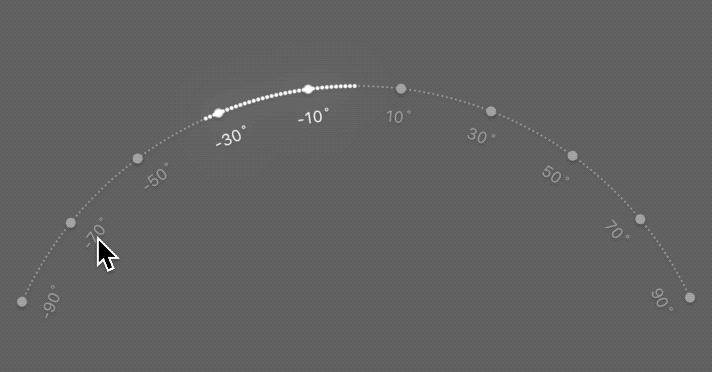

# GNArcControl #

## Setup

        let arc = GNArcControl()
		
Setup division of scale view
		
        arc.division = 10
        arc.subDivision = 5

Setup a range

        arc.minimumValue = -100
        arc.maximumValue = 100
        arc.measure = "%"

## GNArcControlDelegate

	    func arcControlDidChange(_ control:GNArcControl,value:Float)
